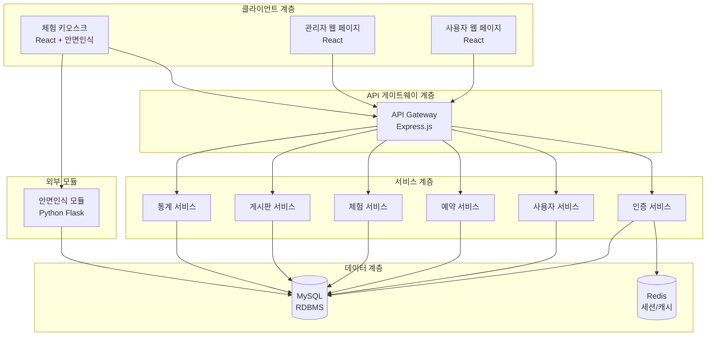
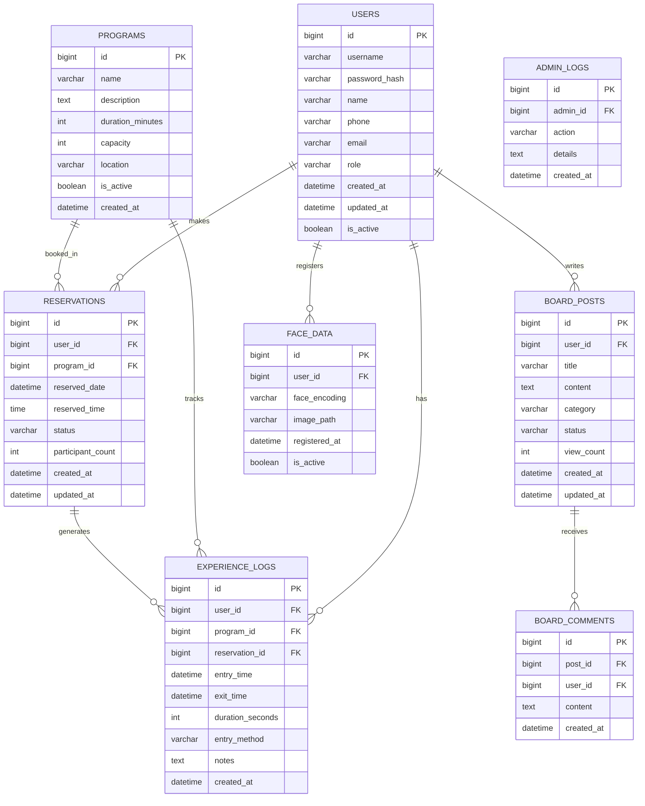
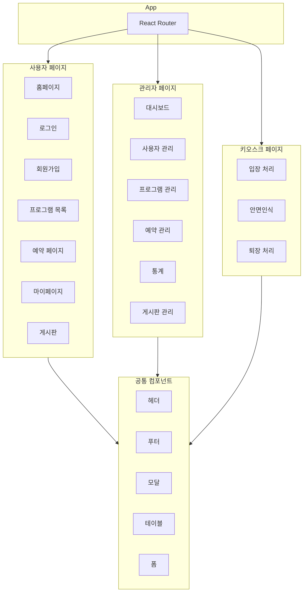
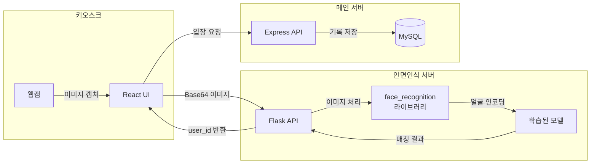
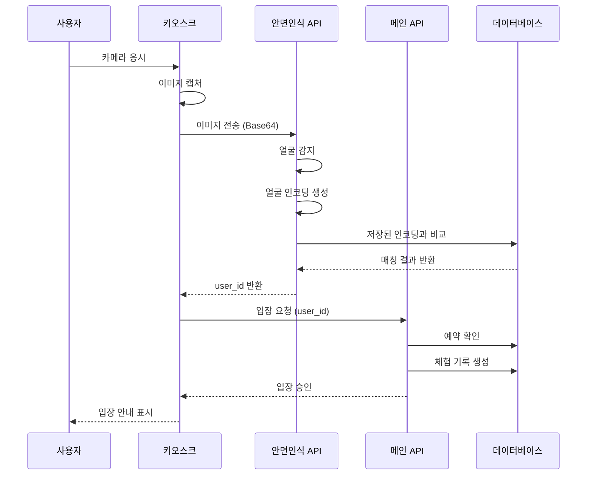

# 안전체험관 자동화 시스템 - 시스템 아키텍처 설계서

## 1. 개요

### 1.1 프로젝트 목적
안전체험관에서 방문객의 입장부터 체험 종료까지의 전 과정을 자동화하는 시스템을 구축하여, 운영 효율성을 높이고 방문객에게 원활한 체험 환경을 제공합니다.

### 1.2 시스템 범위
- 사용자를 위한 웹 포털 (예약, 정보 확인, 문의)
- 체험 관리 시스템 (입장 확인, 체험 진행 추적)
- 관리자 시스템 (데이터 관리, 통계 분석)
- 안면인식 모듈 연동

---

## 2. 시스템 아키텍처 다이어그램

### 2.1 전체 시스템 아키텍처



### 2.2 시스템 구성 요소 설명

| 구성 요소 | 기술 스택 | 설명 |
|-----------|-----------|------|
| 사용자 웹 페이지 | React | 방문객용 웹 인터페이스 |
| 관리자 웹 페이지 | React | 관리자용 대시보드 |
| 체험 키오스크 | React + Electron | 체험장 입장용 키오스크 |
| API 서버 | Node.js + Express | RESTful API 제공 |
| 안면인식 모듈 | Python + Flask | 안면인식 처리 서버 |
| 데이터베이스 | MySQL | 영구 데이터 저장 |
| 캐시 서버 | Redis | 세션 관리 및 캐싱 |

---

## 3. 데이터베이스 ERD 설계

### 3.1 ERD 다이어그램



### 3.2 테이블 상세 설계

#### 3.2.1 USERS (사용자 테이블)

| 컬럼명 | 타입 | 제약조건 | 설명 |
|--------|------|----------|------|
| id | BIGINT | PK, AUTO_INCREMENT | 사용자 고유 ID |
| username | VARCHAR(50) | UNIQUE, NOT NULL | 로그인 ID |
| password_hash | VARCHAR(255) | NOT NULL | 암호화된 비밀번호 |
| name | VARCHAR(100) | NOT NULL | 사용자 이름 |
| phone | VARCHAR(20) | | 연락처 |
| email | VARCHAR(100) | UNIQUE | 이메일 |
| role | ENUM | DEFAULT 'user' | 권한 (user, admin) |
| created_at | DATETIME | DEFAULT NOW | 생성일시 |
| updated_at | DATETIME | ON UPDATE | 수정일시 |
| is_active | BOOLEAN | DEFAULT TRUE | 활성 상태 |

#### 3.2.2 FACE_DATA (안면 데이터 테이블)

| 컬럼명 | 타입 | 제약조건 | 설명 |
|--------|------|----------|------|
| id | BIGINT | PK, AUTO_INCREMENT | 안면데이터 고유 ID |
| user_id | BIGINT | FK, NOT NULL | 사용자 ID |
| face_encoding | TEXT | NOT NULL | 안면 인코딩 데이터 (JSON) |
| image_path | VARCHAR(255) | | 저장된 이미지 경로 |
| registered_at | DATETIME | DEFAULT NOW | 등록일시 |
| is_active | BOOLEAN | DEFAULT TRUE | 활성 상태 |

#### 3.2.3 PROGRAMS (체험 프로그램 테이블)

| 컬럼명 | 타입 | 제약조건 | 설명 |
|--------|------|----------|------|
| id | BIGINT | PK, AUTO_INCREMENT | 프로그램 고유 ID |
| name | VARCHAR(100) | NOT NULL | 프로그램명 |
| description | TEXT | | 프로그램 설명 |
| duration_minutes | INT | DEFAULT 60 | 소요 시간 (분) |
| capacity | INT | DEFAULT 20 | 수용 인원 |
| location | VARCHAR(100) | | 체험 장소 |
| is_active | BOOLEAN | DEFAULT TRUE | 활성 상태 |
| created_at | DATETIME | DEFAULT NOW | 생성일시 |

#### 3.2.4 RESERVATIONS (예약 테이블)

| 컬럼명 | 타입 | 제약조건 | 설명 |
|--------|------|----------|------|
| id | BIGINT | PK, AUTO_INCREMENT | 예약 고유 ID |
| user_id | BIGINT | FK, NOT NULL | 사용자 ID |
| program_id | BIGINT | FK, NOT NULL | 프로그램 ID |
| reserved_date | DATE | NOT NULL | 예약 일자 |
| reserved_time | TIME | NOT NULL | 예약 시간 |
| status | ENUM | DEFAULT 'pending' | 상태 (pending, confirmed, cancelled, completed) |
| participant_count | INT | DEFAULT 1 | 참여 인원 |
| created_at | DATETIME | DEFAULT NOW | 생성일시 |
| updated_at | DATETIME | ON UPDATE | 수정일시 |

#### 3.2.5 EXPERIENCE_LOGS (체험 기록 테이블)

| 컬럼명 | 타입 | 제약조건 | 설명 |
|--------|------|----------|------|
| id | BIGINT | PK, AUTO_INCREMENT | 기록 고유 ID |
| user_id | BIGINT | FK, NOT NULL | 사용자 ID |
| program_id | BIGINT | FK, NOT NULL | 프로그램 ID |
| reservation_id | BIGINT | FK | 예약 ID |
| entry_time | DATETIME | NOT NULL | 입장 시간 |
| exit_time | DATETIME | | 퇴장 시간 |
| duration_seconds | INT | | 체류 시간 (초) |
| entry_method | VARCHAR(20) | DEFAULT 'face' | 입장 방식 (face, manual) |
| notes | TEXT | | 비고 |
| created_at | DATETIME | DEFAULT NOW | 생성일시 |

#### 3.2.6 BOARD_POSTS (게시판 테이블)

| 컬럼명 | 타입 | 제약조건 | 설명 |
|--------|------|----------|------|
| id | BIGINT | PK, AUTO_INCREMENT | 게시글 고유 ID |
| user_id | BIGINT | FK, NOT NULL | 작성자 ID |
| title | VARCHAR(200) | NOT NULL | 제목 |
| content | TEXT | NOT NULL | 내용 |
| category | VARCHAR(50) | DEFAULT 'inquiry' | 카테고리 (inquiry, notice, faq) |
| status | VARCHAR(20) | DEFAULT 'pending' | 상태 (pending, answered, closed) |
| view_count | INT | DEFAULT 0 | 조회수 |
| created_at | DATETIME | DEFAULT NOW | 생성일시 |
| updated_at | DATETIME | ON UPDATE | 수정일시 |

#### 3.2.7 BOARD_COMMENTS (댓글 테이블)

| 컬럼명 | 타입 | 제약조건 | 설명 |
|--------|------|----------|------|
| id | BIGINT | PK, AUTO_INCREMENT | 댓글 고유 ID |
| post_id | BIGINT | FK, NOT NULL | 게시글 ID |
| user_id | BIGINT | FK, NOT NULL | 작성자 ID |
| content | TEXT | NOT NULL | 내용 |
| created_at | DATETIME | DEFAULT NOW | 생성일시 |

#### 3.2.8 ADMIN_LOGS (관리자 로그 테이블)

| 컬럼명 | 타입 | 제약조건 | 설명 |
|--------|------|----------|------|
| id | BIGINT | PK, AUTO_INCREMENT | 로그 고유 ID |
| admin_id | BIGINT | FK, NOT NULL | 관리자 ID |
| action | VARCHAR(50) | NOT NULL | 수행 작업 |
| details | TEXT | | 상세 내용 |
| created_at | DATETIME | DEFAULT NOW | 생성일시 |

---

## 4. API 엔드포인트 구조 설계

### 4.1 API 구조 개요

```
/api/v1
├── /auth              # 인증 관련
├── /users             # 사용자 관리
├── /programs          # 체험 프로그램
├── /reservations      # 예약 관리
├── /experiences       # 체험 기록
├── /board             # 게시판
├── /admin             # 관리자 기능
└── /face              # 안면인식
```

### 4.2 상세 API 엔드포인트

#### 4.2.1 인증 API (/api/v1/auth)

| Method | Endpoint | 설명 | 권한 |
|--------|----------|------|------|
| POST | /register | 회원가입 | Public |
| POST | /login | 로그인 | Public |
| POST | /logout | 로그아웃 | User |
| POST | /refresh | 토큰 갱신 | User |
| GET | /me | 내 정보 조회 | User |
| POST | /password/reset | 비밀번호 재설정 요청 | Public |
| PUT | /password/reset | 비밀번호 재설정 | Public |

#### 4.2.2 사용자 API (/api/v1/users)

| Method | Endpoint | 설명 | 권한 |
|--------|----------|------|------|
| GET | /profile | 내 프로필 조회 | User |
| PUT | /profile | 프로필 수정 | User |
| DELETE | /account | 계정 탈퇴 | User |
| GET | /reservations | 내 예약 목록 | User |
| GET | /experiences | 내 체험 기록 | User |

#### 4.2.3 체험 프로그램 API (/api/v1/programs)

| Method | Endpoint | 설명 | 권한 |
|--------|----------|------|------|
| GET | / | 프로그램 목록 조회 | Public |
| GET | /:id | 프로그램 상세 조회 | Public |
| GET | /:id/slots | 예약 가능 시간 조회 | Public |
| POST | / | 프로그램 등록 | Admin |
| PUT | /:id | 프로그램 수정 | Admin |
| DELETE | /:id | 프로그램 삭제 | Admin |

#### 4.2.4 예약 API (/api/v1/reservations)

| Method | Endpoint | 설명 | 권한 |
|--------|----------|------|------|
| GET | / | 예약 목록 조회 | User |
| POST | / | 예약 생성 | User |
| GET | /:id | 예약 상세 조회 | User |
| PUT | /:id | 예약 수정 | User |
| DELETE | /:id | 예약 취소 | User |
| GET | /check-availability | 예약 가능 여부 확인 | Public |

#### 4.2.5 체험 기록 API (/api/v1/experiences)

| Method | Endpoint | 설명 | 권한 |
|--------|----------|------|------|
| POST | /entry | 입장 등록 | Kiosk |
| PUT | /:id/exit | 퇴장 처리 | Kiosk |
| GET | /:id | 체험 기록 상세 | User |
| GET | /today | 금일 체험자 목록 | Admin |
| GET | /stats | 체험 통계 | Admin |

#### 4.2.6 게시판 API (/api/v1/board)

| Method | Endpoint | 설명 | 권한 |
|--------|----------|------|------|
| GET | /posts | 게시글 목록 | Public |
| POST | /posts | 게시글 작성 | User |
| GET | /posts/:id | 게시글 상세 | Public |
| PUT | /posts/:id | 게시글 수정 | User (작성자) |
| DELETE | /posts/:id | 게시글 삭제 | User (작성자) |
| POST | /posts/:id/comments | 댓글 작성 | User |
| GET | /posts/:id/comments | 댓글 목록 | Public |
| DELETE | /comments/:id | 댓글 삭제 | User (작성자) |

#### 4.2.7 관리자 API (/api/v1/admin)

| Method | Endpoint | 설명 | 권한 |
|--------|----------|------|------|
| GET | /users | 사용자 목록 조회 | Admin |
| GET | /users/:id | 사용자 상세 조회 | Admin |
| PUT | /users/:id/status | 사용자 상태 변경 | Admin |
| GET | /reservations | 전체 예약 조회 | Admin |
| GET | /experiences | 전체 체험 기록 | Admin |
| GET | /statistics/dashboard | 대시보드 통계 | Admin |
| GET | /statistics/daily | 일별 통계 | Admin |
| GET | /statistics/programs | 프로그램별 통계 | Admin |
| GET | /logs | 관리자 로그 조회 | Admin |

#### 4.2.8 안면인식 API (/api/v1/face)

| Method | Endpoint | 설명 | 권한 |
|--------|----------|------|------|
| POST | /register | 안면 데이터 등록 | User |
| POST | /verify | 안면 인식 검증 | Kiosk |
| DELETE | /:userId | 안면 데이터 삭제 | User/Admin |
| GET | /status/:userId | 등록 상태 확인 | User |

### 4.3 API 응답 표준 포맷

```json
{
  "success": true,
  "code": 200,
  "message": "요청이 성공했습니다.",
  "data": {
    // 응답 데이터
  },
  "pagination": {
    "page": 1,
    "limit": 10,
    "total": 100,
    "totalPages": 10
  }
}
```

### 4.4 에러 응답 포맷

```json
{
  "success": false,
  "code": 400,
  "message": "잘못된 요청입니다.",
  "errors": [
    {
      "field": "email",
      "message": "유효한 이메일 형식이 아닙니다."
    }
  ]
}
```

---

## 5. 프론트엔드 컴포넌트 구조 설계

### 5.1 컴포넌트 계층 구조

```
src/
├── components/              # 공통 컴포넌트
│   ├── common/
│   │   ├── Button/
│   │   ├── Input/
│   │   ├── Modal/
│   │   ├── Table/
│   │   ├── Pagination/
│   │   ├── Loading/
│   │   └── Toast/
│   ├── layout/
│   │   ├── Header/
│   │   ├── Footer/
│   │   ├── Sidebar/
│   │   ├── Layout/
│   │   └── Navigation/
│   └── forms/
│       ├── LoginForm/
│       ├── RegisterForm/
│       ├── ReservationForm/
│       └── PostForm/
│
├── pages/                   # 페이지 컴포넌트
│   ├── user/
│   │   ├── Home/
│   │   ├── Login/
│   │   ├── Register/
│   │   ├── Programs/
│   │   ├── Reservation/
│   │   ├── MyPage/
│   │   └── Board/
│   ├── admin/
│   │   ├── Dashboard/
│   │   ├── UserManagement/
│   │   ├── ProgramManagement/
│   │   ├── ReservationManagement/
│   │   ├── ExperienceManagement/
│   │   ├── Statistics/
│   │   └── BoardManagement/
│   └── kiosk/
│       ├── Entry/
│       ├── FaceRecognition/
│       └── Exit/
│
├── hooks/                   # 커스텀 훅
│   ├── useAuth.js
│   ├── useReservation.js
│   ├── useExperience.js
│   ├── useBoard.js
│   └── useStatistics.js
│
├── services/                # API 서비스
│   ├── api.js
│   ├── authService.js
│   ├── userService.js
│   ├── programService.js
│   ├── reservationService.js
│   ├── experienceService.js
│   └── boardService.js
│
├── store/                   # 상태 관리
│   ├── index.js
│   ├── slices/
│   │   ├── authSlice.js
│   │   ├── reservationSlice.js
│   │   └── uiSlice.js
│   └── store.js
│
├── utils/                   # 유틸리티
│   ├── constants.js
│   ├── helpers.js
│   ├── validators.js
│   └── formatters.js
│
└── styles/                  # 스타일
    ├── variables.scss
    ├── mixins.scss
    └── global.scss
```

### 5.2 주요 컴포넌트 다이어그램



### 5.3 페이지별 주요 기능

#### 5.3.1 사용자 페이지

| 페이지 | 경로 | 주요 기능 |
|--------|------|-----------|
| 홈 | / | 프로그램 소개, 공지사항, 빠른 예약 |
| 로그인 | /login | 로그인 폼, 소셜 로그인 |
| 회원가입 | /register | 회원가입 폼, 안면등록 안내 |
| 프로그램 목록 | /programs | 프로그램 리스트, 상세 보기 |
| 예약 | /reservation/:programId | 예약 폼, 시간 선택, 확인 |
| 마이페이지 | /mypage | 예약 현황, 체험 기록, 프로필 |
| 게시판 | /board | 문의 목록, 작성, 상세 |

#### 5.3.2 관리자 페이지

| 페이지 | 경로 | 주요 기능 |
|--------|------|-----------|
| 대시보드 | /admin | 오늘 현황, 최근 예약, 통계 요약 |
| 사용자 관리 | /admin/users | 사용자 목록, 검색, 상태 변경 |
| 프로그램 관리 | /admin/programs | 프로그램 CRUD |
| 예약 관리 | /admin/reservations | 예약 목록, 승인/취소 |
| 통계 | /admin/statistics | 그래프, 리포트 |
| 게시판 관리 | /admin/board | 게시글 관리, 답변 |

#### 5.3.3 키오스크 페이지

| 페이지 | 경로 | 주요 기능 |
|--------|------|-----------|
| 입장 | /kiosk/entry | 안면인식, 예약 확인, 입장 처리 |
| 안면등록 | /kiosk/register | 안면 데이터 등록 |
| 퇴장 | /kiosk/exit | 퇴장 처리, 체험 시간 표시 |

---

## 6. 안면인식 모듈 연동 방안

### 6.1 안면인식 시스템 구성



### 6.2 안면인식 API 명세

#### 6.2.1 안면 데이터 등록

**요청**
```http
POST /api/v1/face/register
Content-Type: multipart/form-data

{
  "user_id": 123,
  "image": "<base64_encoded_image>"
}
```

**응답**
```json
{
  "success": true,
  "code": 200,
  "message": "안면 데이터가 등록되었습니다.",
  "data": {
    "face_id": 1,
    "user_id": 123
  }
}
```

#### 6.2.2 안면 인식 검증

**요청**
```http
POST /api/v1/face/verify
Content-Type: application/json

{
  "image": "<base64_encoded_image>",
  "program_id": 1
}
```

**응답 (성공)**
```json
{
  "success": true,
  "code": 200,
  "message": "본인 확인 완료",
  "data": {
    "user_id": 123,
    "name": "홍길동",
    "reservation": {
      "id": 456,
      "program_name": "화재 대피 체험",
      "reserved_time": "10:00"
    }
  }
}
```

**응답 (실패)**
```json
{
  "success": false,
  "code": 404,
  "message": "등록된 안면 데이터를 찾을 수 없습니다."
}
```

### 6.3 안면인식 처리 흐름



### 6.4 안면인식 모듈 기술 사양

| 항목 | 사양 |
|------|------|
| 라이브러리 | face_recognition (Python) |
| 프레임워크 | Flask |
| 모델 | HOG + CNN 하이브리드 |
| 인식 정확도 | 99.38% (LFW 기준) |
| 처리 속도 | 0.5초 이내 (단일 얼굴) |
| 이미지 형식 | JPEG, PNG |
| 최소 해상도 | 640x480 |
| 통신 방식 | REST API (JSON) |

### 6.5 보안 고려사항

1. **데이터 암호화**: 안면 인코딩 데이터는 암호화하여 저장
2. **전송 보안**: HTTPS 통신 필수
3. **접근 제한**: 안면인식 API는 내부 네트워크에서만 접근 가능
4. **데이터 보관**: 사용자 탈퇴 시 안면 데이터 즉시 삭제
5. **로그 기록**: 모든 인식 시도 로그 저장

---

## 7. 프로젝트 폴더 구조

### 7.1 전체 프로젝트 구조

```
safety-experience-system/
├── frontend/                    # 프론트엔드 프로젝트
│   ├── public/
│   │   ├── index.html
│   │   └── assets/
│   ├── src/
│   │   ├── components/
│   │   ├── pages/
│   │   ├── hooks/
│   │   ├── services/
│   │   ├── store/
│   │   ├── utils/
│   │   ├── styles/
│   │   ├── App.jsx
│   │   └── index.js
│   ├── package.json
│   └── vite.config.js
│
├── backend/                     # 백엔드 프로젝트
│   ├── src/
│   │   ├── config/
│   │   │   ├── database.js
│   │   │   ├── redis.js
│   │   │   └── jwt.js
│   │   ├── controllers/
│   │   │   ├── authController.js
│   │   │   ├── userController.js
│   │   │   ├── programController.js
│   │   │   ├── reservationController.js
│   │   │   ├── experienceController.js
│   │   │   ├── boardController.js
│   │   │   └── adminController.js
│   │   ├── middlewares/
│   │   │   ├── auth.js
│   │   │   ├── validator.js
│   │   │   ├── errorHandler.js
│   │   │   └── rateLimiter.js
│   │   ├── models/
│   │   │   ├── User.js
│   │   │   ├── FaceData.js
│   │   │   ├── Program.js
│   │   │   ├── Reservation.js
│   │   │   ├── ExperienceLog.js
│   │   │   ├── BoardPost.js
│   │   │   └── BoardComment.js
│   │   ├── routes/
│   │   │   ├── index.js
│   │   │   ├── authRoutes.js
│   │   │   ├── userRoutes.js
│   │   │   ├── programRoutes.js
│   │   │   ├── reservationRoutes.js
│   │   │   ├── experienceRoutes.js
│   │   │   ├── boardRoutes.js
│   │   │   └── adminRoutes.js
│   │   ├── services/
│   │   │   ├── authService.js
│   │   │   ├── userService.js
│   │   │   ├── programService.js
│   │   │   ├── reservationService.js
│   │   │   ├── experienceService.js
│   │   │   └── boardService.js
│   │   ├── utils/
│   │   │   ├── logger.js
│   │   │   ├── response.js
│   │   │   └── validators.js
│   │   └── app.js
│   ├── package.json
│   └── .env.example
│
├── face-recognition/            # 안면인식 모듈
│   ├── src/
│   │   ├── app.py
│   │   ├── face_service.py
│   │   ├── models/
│   │   │   └── face_encoder.py
│   │   └── utils/
│   │       └── image_processor.py
│   ├── requirements.txt
│   └── Dockerfile
│
├── database/                    # 데이터베이스 스크립트
│   ├── migrations/
│   │   └── 001_init.sql
│   ├── seeds/
│   │   └── sample_data.sql
│   └── backup/
│
├── docs/                        # 문서
│   ├── architecture.md
│   ├── api-spec.md
│   └── deployment.md
│
├── docker-compose.yml
├── .gitignore
└── README.md
```

### 7.2 환경 설정 파일

#### backend/.env.example
```env
# Server
PORT=3000
NODE_ENV=development

# Database
DB_HOST=localhost
DB_PORT=3306
DB_NAME=safety_experience
DB_USER=root
DB_PASSWORD=password

# Redis
REDIS_HOST=localhost
REDIS_PORT=6379

# JWT
JWT_SECRET=your-secret-key
JWT_EXPIRES_IN=1d
JWT_REFRESH_EXPIRES_IN=7d

# Face Recognition Service
FACE_API_URL=http://localhost:5000

# CORS
CORS_ORIGIN=http://localhost:5173
```

### 7.3 Docker Compose 구성

```yaml
version: '3.8'

services:
  frontend:
    build: ./frontend
    ports:
      - "5173:5173"
    volumes:
      - ./frontend:/app
    depends_on:
      - backend

  backend:
    build: ./backend
    ports:
      - "3000:3000"
    environment:
      - NODE_ENV=development
    volumes:
      - ./backend:/app
    depends_on:
      - mysql
      - redis

  face-recognition:
    build: ./face-recognition
    ports:
      - "5000:5000"
    volumes:
      - ./face-recognition:/app

  mysql:
    image: mysql:8.0
    ports:
      - "3306:3306"
    environment:
      MYSQL_ROOT_PASSWORD: password
      MYSQL_DATABASE: safety_experience
    volumes:
      - mysql_data:/var/lib/mysql
      - ./database/migrations:/docker-entrypoint-initdb.d

  redis:
    image: redis:7-alpine
    ports:
      - "6379:6379"
    volumes:
      - redis_data:/data

volumes:
  mysql_data:
  redis_data:
```

---

## 8. 보안 설계

### 8.1 인증 및 인가

- **JWT 기반 인증**: Access Token + Refresh Token 방식
- **Role-Based Access Control**: 사용자/관리자 권한 분리
- **세션 관리**: Redis를 활용한 세션 저장 및 블랙리스트 관리

### 8.2 데이터 보안

- **비밀번호 암호화**: bcrypt (salt rounds: 10)
- **민감 정보 암호화**: AES-256 암호화
- **SQL Injection 방지**: Prepared Statement 사용
- **XSS 방지**: 입력값 검증 및 출력값 이스케이프

### 8.3 API 보안

- **Rate Limiting**: IP/사용자별 요청 제한
- **CORS 설정**: 허용된 도메인만 접근
- **HTTPS 강제**: 프로덕션 환경에서 HTTPS만 허용
- **API Key**: 외부 연동 시 API Key 인증

---

## 9. 성능 최적화 방안

### 9.1 프론트엔드

- **코드 스플리팅**: 페이지별 lazy loading
- **이미지 최적화**: WebP 포맷, lazy loading
- **캐싱**: React Query를 활용한 데이터 캐싱
- **번들 최적화**: Tree shaking, 압축

### 9.2 백엔드

- **DB 인덱싱**: 자주 조회하는 컬럼 인덱스 생성
- **쿼리 최적화**: N+1 문제 방지, JOIN 최적화
- **캐싱**: Redis를 활용한 자주 조회 데이터 캐싱
- **커넥션 풀**: DB 커넥션 풀 관리

### 9.3 인프라

- **로드 밸런싱**: 트래픽 분산
- **CDN**: 정적 리소스 CDN 활용
- **모니터링**: 로그 수집 및 성능 모니터링

---

## 10. 확장성 고려사항

### 10.1 마이크로서비스 전환

현재 모놀리식 구조에서 향후 마이크로서비스로 전환 가능하도록 설계:
- 서비스별 독립적인 데이터베이스 스키마
- API 게이트웨이 패턴 적용
- 이벤트 기반 통신 준비

### 10.2 추가 기능 확장

- **모바일 앱**: React Native 기반 모바일 앱 개발
- **알림 시스템**: 예약 확인, 체험 안내 푸시 알림
- **QR 코드**: 예약 확인용 QR 코드 발급
- **다국어 지원**: i18n 적용

---

## 11. 요약

본 설계서는 안전체험관 자동화 시스템의 전체 아키텍처를 다루고 있습니다:

1. **3-Tier 아키텍처**: 클라이언트-서버-데이터베이스 구조
2. **RESTful API**: 표준화된 API 설계
3. **안면인식 연동**: 별도 Python 서버로 분리하여 유연성 확보
4. **확장 가능한 구조**: 향후 기능 추가 및 마이크로서비스 전환 고려

이 설계를 바탕으로 개발을 진행하며, 구현 단계에서 세부 사항은 조정될 수 있습니다.
