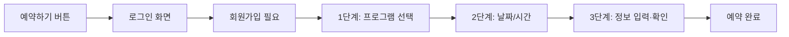
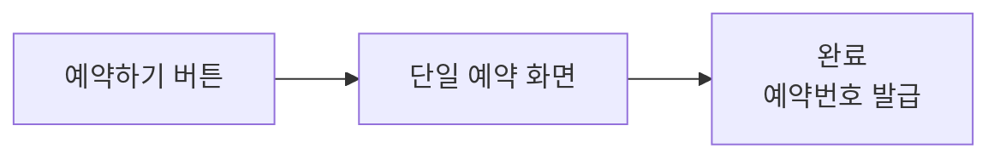
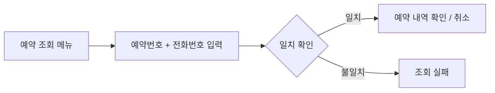
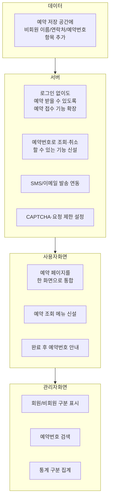

# 비회원 예약 & 한 화면 예약 도입 기획안

> **대상 독자**: 기획/운영/관리자 등 비개발자
> **한 줄 요약**: 회원가입 없이도 예약이 가능하도록 하고, 기존 3단계로 나누어진 예약 화면을 **한 페이지에서 모두 처리**할 수 있게 개선합니다.

---

## 1. 왜 바꾸려고 하나요?

### 현재의 불편한 점
1. **가입해야만 예약 가능** — 방문 한 번 하려는 가족·단체도 회원가입(이메일/비밀번호 등) 후에야 예약할 수 있어 **이탈률이 높습니다.**
2. **3단계로 나뉜 예약 화면** — "프로그램 선택 → 날짜/시간 → 확인"으로 페이지가 넘어가, 앞뒤로 왔다갔다 해야 하고 시간이 오래 걸립니다.

### 개선 후 기대 효과
- 회원가입 부담 제거 → **예약 완료율 상승**
- 한 화면에서 선택 상태를 **실시간으로 확인**하며 빠르게 예약 가능 → **사용성 개선**
- 단체/일회성 방문객 대응이 쉬워짐 → **운영 편의성 향상**

---

## 2. 이용자 입장에서 무엇이 달라지나요?

### Before (현재)


### After (변경 후)


### 비회원이 보는 한 화면의 구성 예시

```
┌─────────────────────────────────────────────────────────────┐
│                        체험 예약                              │
├──────────────────┬──────────────────┬───────────────────────┤
│                  │                  │                       │
│  ① 프로그램 선택   │  ② 날짜/시간      │  ③ 예약자 정보        │
│                  │                  │                       │
│  ○ 지진 체험      │  [달력]           │  이름:    [        ] │
│  ● 화재 대피      │  ○ 10:00 (5석)   │  연락처:  [        ] │
│  ○ 응급처치       │  ● 11:00 (3석)   │  이메일:  [        ] │
│                  │  ○ 13:00 (2석)   │  인원:    [ 2 ▼ ]    │
│                  │                  │  [✓] 개인정보 동의     │
│                  │                  │                       │
├──────────────────┴──────────────────┴───────────────────────┤
│  요약: 화재 대피 · 2026-05-10 11:00 · 2명    [ 예약 완료 ]   │
└─────────────────────────────────────────────────────────────┘
```

**핵심 포인트**
- 로그인 상태라면 이름·연락처는 자동 채워짐
- 비회원이라면 이름/연락처/이메일을 직접 입력
- 하단 요약 바는 선택할 때마다 **실시간으로 갱신**
- "예약 완료" 버튼은 필수 항목이 모두 채워져야 활성화

---

## 3. 비회원 예약의 작동 방식

### 예약 완료 후
- 시스템이 **예약번호**(예: `20260510-AB12CD`)를 자동 발급합니다.
- 화면에 크게 안내되며, **SMS/이메일로도 발송**합니다.
- 이 번호가 회원의 "마이페이지" 역할을 대신합니다.

### 비회원은 어떻게 예약을 조회·취소하나요?

- 상단 메뉴에 "**예약 조회**" 추가
- 예약번호 + 등록한 전화번호가 일치할 때만 조회/취소 가능
- 무작위로 남의 예약을 볼 수 없도록 보호

### 당일 방문(체크인)은?
- 키오스크(현장 단말)에서 **예약번호 또는 전화번호**를 입력해 체크인
- 회원의 경우 기존처럼 안면인식 가능 (비회원은 안면인식 미등록이므로 번호 입력 사용)

---

## 4. 관리자에게는 무엇이 달라지나요?

### 예약 관리 화면
| 구분 | 현재 | 변경 후 |
|---|---|---|
| 예약자 | 회원 이름만 표시 | **회원/비회원** 구분 태그 표시 |
| 비회원 예약 | 없음 | 이름·연락처·예약번호 함께 표시 |
| 검색 | 이름·프로그램 | **예약번호 검색** 추가 |
| 통계 | 회원 기준 | **회원/비회원 구분 집계** |

### 운영상 변화
- 비회원에게는 마이페이지가 없으므로 **SMS/알림톡/이메일 발송이 필수**
  - 접수 안내, 리마인더, 변경/취소 알림
- 개인정보 보관 기간 정책 필요 (예: 체험 완료 후 90일 뒤 자동 익명화)

---

## 5. 수집하는 정보 (개인정보 최소화)

| 구분 | 회원 | 비회원 |
|---|---|---|
| 이름 | ✓ (가입 시) | **필수** |
| 연락처 | ✓ (가입 시) | **필수** |
| 이메일 | ✓ (가입 시) | 선택 |
| 비밀번호 | ✓ | 없음 (또는 간단 PIN, 선택) |
| 개인정보 동의 | 가입 시 | **예약 시마다 체크 필요** |

> 비회원 정보는 "예약 처리"에 꼭 필요한 최소 정보만 수집하며, 법령/내부 정책에 따른 보관기간 경과 후 자동 파기(익명화)합니다.

---

## 6. 보안/남용 방지

비회원이 열려 있으면 자동화된 장난 예약이 늘어날 수 있으므로 다음 장치가 필요합니다.

| 장치 | 역할 |
|---|---|
| **자동입력 방지 (CAPTCHA)** | "로봇이 아닙니다" 체크로 봇 예약 차단 |
| **IP당 요청 제한** | 같은 주소에서 단시간 다수 예약 시도 차단 |
| **전화번호당 예약 수 제한** | 예: 미래 미완료 예약 3건까지 |
| **조회 시 2요소 검증** | 예약번호 + 전화번호 일치해야 조회 허용 |

---

## 7. 변경 범위 요약 (비개발자용)



---

## 8. 진행 순서 (로드맵)

단계별로 **기존 기능을 깨지 않으면서** 도입하는 순서입니다.

| 단계 | 내용 | 이용자 체감 |
|---|---|---|
| 1 | 예약 데이터 저장 공간에 비회원 항목 추가 | 변화 없음 (내부 준비) |
| 2 | 서버에서 비회원 예약을 접수할 수 있게 기능 확장 | 변화 없음 (내부 준비) |
| 3 | 비회원 조회/취소 API + 보안 장치 추가 | 변화 없음 (내부 준비) |
| 4 | **예약 페이지 한 화면으로 리뉴얼 + 비회원 오픈** | 🎉 **대외 공개** |
| 5 | 예약 조회 페이지·메뉴 추가 | 비회원도 예약 확인/취소 가능 |
| 6 | 관리자 화면·통계 업데이트 | 관리자 편의 개선 |
| 7 | SMS/알림톡·이메일 알림 연동 | 비회원도 안내 수신 |

---

## 9. 결정이 필요한 사항 (기획 확정 포인트)

다음 항목은 개발 착수 전에 **기획·운영 측에서 정해주셔야** 하는 부분입니다.

1. **비회원에게 비밀번호/PIN을 받을지?**
   - ❎ 받지 않음: 예약번호+전화번호로 조회 (편함, 약간의 보안 완화)
   - ✅ 받음: 조회 시 한 번 더 확인 (안전하나 사용자 번거로움)
2. **알림 수단 선택**: SMS / 카카오 알림톡 / 이메일 중 어느 것까지 사용할지
3. **개인정보 보관 기간**: 체험 완료 후 몇 일 뒤 자동 파기할지 (예: 30/60/90일)
4. **전화번호당 예약 가능 수**: 예) 동시 미완료 3건 / 하루 1건 등
5. **CAPTCHA 공급자 선택**: hCaptcha / reCAPTCHA 중 선택
6. **개인정보처리방침 문구** 준비 (동의 체크박스에 연결)
7. **비회원 예약 가능 프로그램 제한 여부**: 모든 프로그램 OR 특정 프로그램만
8. **기존 회원에게 주는 혜택 유지 여부**: 비회원이 늘어나도 회원 전용 기능(마이페이지, 안면인식, 이력 등)을 유지/강화할지

---

## 10. 예상 Q&A

**Q. 비회원 예약만으로도 충분하면 회원 기능을 없애도 되지 않나요?**
A. 회원 기능은 **반복 방문자 편의(마이페이지, 이력, 안면인식 체크인)**에 여전히 유용합니다. 두 방식을 병행하는 것이 일반적입니다.

**Q. 비회원이 예약번호를 잃어버리면?**
A. 등록한 전화번호로 "예약번호 재전송" 기능을 제공하거나, 관리자 화면에서 연락처로 검색해 안내할 수 있습니다.

**Q. 비회원이 여러 번 장난 예약하면?**
A. CAPTCHA · IP 제한 · 전화번호당 건수 제한 · 노쇼 누적 시 차단 정책으로 대응합니다.

**Q. 개인정보 보호가 걱정됩니다.**
A. 수집 항목을 이름/연락처로 최소화하고, 보관 기간 경과 후 자동 익명화합니다. 예약 조회 시 2요소(예약번호+전화번호)를 요구해 타인 열람을 방지합니다.

**Q. 한 화면에 정보가 많아 복잡해 보이지 않을까요?**
A. 데스크톱은 3열 구성, 모바일은 아래로 자연스럽게 쌓이는 1열 구성으로 반응형 설계합니다. 또한 하단 요약바가 항상 선택 상태를 보여주어 혼란을 줄입니다.

---

## 부록. 용어 정리

| 용어 | 쉬운 설명 |
|---|---|
| 비회원(게스트) 예약 | 회원가입 없이 이름·연락처만으로 하는 예약 |
| 예약번호(Reservation Code) | 비회원의 "회원 ID" 대신 쓰는 고유 번호 |
| CAPTCHA | "나는 로봇이 아닙니다" 같은 봇 차단 장치 |
| Rate Limit | 짧은 시간에 같은 사람이 너무 많이 요청하는 것을 막는 장치 |
| 마이그레이션 | 기존 데이터를 새 구조로 옮기거나 확장하는 작업 |
| 키오스크 | 현장에 비치된 자동 체크인 단말기 |

---

*작성 목적: 비회원 예약 도입 여부·방식에 대한 경영/운영진의 의사결정을 지원하기 위한 문서입니다.*
